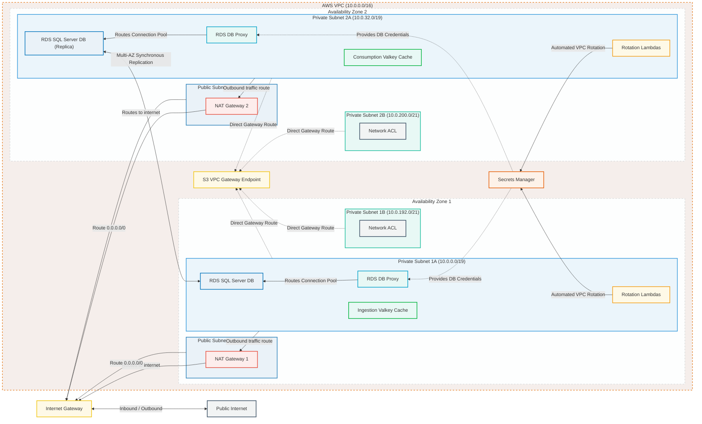
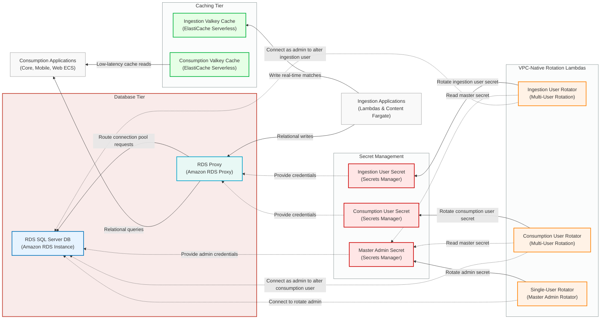
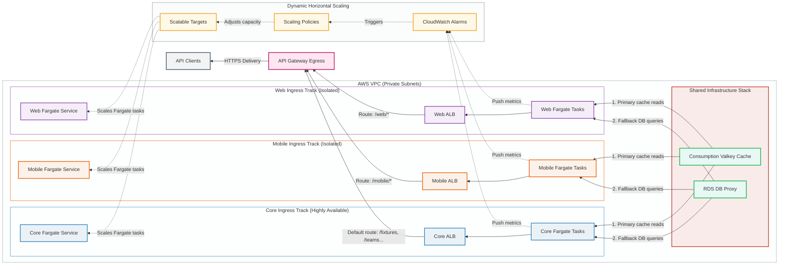

# CricViz Stats Platform: Complete Architecture & Data Flow Specification

This document serves as the master architectural specification for the CricViz Stats Platform. It compiles all system-wide and subsystem-specific diagrams, detail-mapping the end-to-end data flows, network boundaries, persistent databases, caching structures, and automated security rotation mechanisms.

---

## 🗺️ 1. Master Application Skeleton & Data Flow

This diagram provides a global view of the entire application data lifecycle, mapping how match updates, webhooks, and client queries flow through the platform.

### Master Data Flow Diagram

```mermaid
graph RL
    %% Custom Styling
    classDef source fill:#f2f4f4,stroke:#34495e,stroke-width:2px;
    classDef gateway fill:#ffe6f2,stroke:#b30059,stroke-width:2px;
    classDef buffer fill:#ffe6e6,stroke:#cc0000,stroke-width:2px;
    classDef compute fill:#fef9e7,stroke:#f39c12,stroke-width:2px;
    classDef storage fill:#e8f8f5,stroke:#00b33c,stroke-width:2px;
    classDef egress fill:#eaf2f8,stroke:#2980b9,stroke-width:2px;
    classDef cdn fill:#f5eef8,stroke:#8e44ad,stroke-width:2px;

    %% ----------------------------------------------------
    %% RIGHT SIDE: DATA INGESTION PART
    %% ----------------------------------------------------
    subgraph IngestionSources ["Feed & Webhook Sources (Far Right)"]
        Src_CricViz["CricViz Feed Provider"]:::source
        Src_Airship["Airship Events Provider"]:::source
        Src_Pulse["Pulselive Webhooks"]:::source
        Src_BC["Brightcove Webhooks"]:::source
    end

    subgraph IngressGates ["Ingress Gates & Buffers (Middle-Right)"]
        APIGW_Data["Data Ingestion API Gateway"]:::gateway
        APIGW_Content["Content Ingestion API Gateway"]:::gateway

        Kinesis_Stream["Kinesis Ingestion Stream"]:::buffer
        SQS_Content_Queue["SQS Ingestion Queue"]:::buffer
    end

    subgraph IngressCompute ["Ingress Compute Tier (Middle-Right VPC)"]
        direction TB
        ProxyLambda["API Kinesis Proxy Lambda"]:::compute

        subgraph StreamProcessors ["Ingestion Processors"]
            direction TB
            Lambda_BBB["Ball-by-Ball Processor Lambda"]:::compute
            Lambda_Other["Other Ingestion Processor Lambdas"]:::compute
        end

        Fargate_Ingest["ECS Content Ingestion Service"]:::compute
    end

    %% ----------------------------------------------------
    %% CENTER: DATABASE & BUSINESS HANDLERS
    %% ----------------------------------------------------
    subgraph StorageTier ["Shared Data Layer (Center VPC)"]
        direction TB
        Valkey_Ingest["Ingestion Valkey Cache"]:::storage
        RDS_Proxy["RDS DB Proxy"]:::storage
        RDS_DB["RDS SQL Server DB"]:::storage
        Valkey_Consum["Consumption Valkey Cache"]:::storage
    end

    subgraph DataLake ["Archival Tier (Center Storage)"]
        Kinesis_Firehose["Kinesis Firehose"]:::buffer
        S3_Backup["S3 Backup Bucket"]:::storage
    end

    subgraph Resiliency ["Failure Resiliency (Center Ops)"]
        S3_Failure["S3 Failure Bucket"]:::buffer
        SQS_Failure["SQS Failure Queue"]:::buffer
    end

    subgraph OpsMigrations ["Database Schema Migrations (Center Ops)"]
        CFN_Deploy["CloudFormation Deployment"]:::gateway
        Custom_Res["RunMigration Custom Resource"]:::gateway
        Migrate_Lambda["RunMigration Lambda Handler"]:::compute
        Fargate_Migrate["Flyway Migration Fargate Task"]:::compute
    end

    %% ----------------------------------------------------
    %% LEFT SIDE: CONSUMER PART
    %% ----------------------------------------------------
    subgraph EgressCompute ["Egress Compute Tier (Middle-Left VPC)"]
        direction TB
        ALB_Core["Core ALB"]:::egress
        ECS_Core["Core ECS Service"]:::egress

        ALB_Mobile["Mobile ALB"]:::egress
        ECS_Mobile["Mobile ECS Service"]:::egress

        ALB_Web["Web ALB"]:::egress
        ECS_Web["Web ECS Service"]:::egress
    end

    subgraph ConsumerGateways ["Client Delivery & Portal Edge (Middle-Left)"]
        APIGW_Consum["Data Consumption API Gateway"]:::gateway

        Route53["Route 53 DNS"]:::cdn
        CloudFront["CloudFront CDN"]:::cdn
        ALB_Maint["Maintenance ALB"]:::egress
        ECS_Maint["ECS Maintenance Service"]:::compute
    end

    subgraph ConsumerClients ["API Consumers & Portal Admins (Far Left)"]
        App_Clients["API Clients"]:::source
        Portal_Admins["Portal Administrators"]:::source
    end

    %% ====================================================
    %% FLOW CONNECTIONS (RIGHT-TO-CENTER-TO-LEFT)
    %% ====================================================

    %% 1. Streaming Data Ingestion Flow (Right -> Center)
    Src_CricViz & Src_Airship -->|1. Event Payloads| APIGW_Data
    APIGW_Data -->|2. Ingress HTTP Forward| ProxyLambda
    ProxyLambda -->|3. Buffer Write| Kinesis_Stream
    Kinesis_Stream -->|4. Trigger Batch| StreamProcessors
    StreamProcessors -->|5a. High-Speed Cache| Valkey_Ingest
    StreamProcessors -->|5b. Relational Insert| RDS_Proxy

    %% Streaming Archiving
    Kinesis_Stream -->|6. Raw Stream Delivery| Kinesis_Firehose
    Kinesis_Firehose -->|7. Compress & Archive| S3_Backup

    %% Streaming Failure Handling
    StreamProcessors -.->|8a. Dump Failed Records| S3_Failure
    S3_Failure -.->|8b. Trigger Alert notification| SQS_Failure

    %% 2. Content Ingestion Flow (Right -> Center)
    Src_Pulse & Src_BC -->|1. Webhooks| APIGW_Content
    APIGW_Content -->|2a. High-Volume Async Buffer| SQS_Content_Queue
    Fargate_Ingest -->|2b. Poll Webhook Messages| SQS_Content_Queue

    APIGW_Content -->|3a. Direct Sync Traffic| Fargate_Ingest
    Fargate_Ingest -->|4a. Ingest Cache Updates| Valkey_Ingest
    Fargate_Ingest -->|4b. Persistent DB Writes| RDS_Proxy

    %% DB Structure Connection (Right -> Left within Center)
    RDS_Proxy -->|Routes Connection Pool| RDS_DB
    Valkey_Ingest -.->|Real-time Cache Refresh| Valkey_Consum

    %% 3. Data Consumption Flow (Center -> Left)
    Valkey_Consum -->|3a. Low-Latency Cache Reads| ECS_Core & ECS_Mobile & ECS_Web
    RDS_Proxy -->|3b. DB Query fallback| ECS_Core & ECS_Mobile & ECS_Web

    ECS_Core --> ALB_Core
    ECS_Mobile --> ALB_Mobile
    ECS_Web --> ALB_Web

    ALB_Core -->|2a. Core path| APIGW_Consum
    ALB_Mobile -->|2b. Mobile path| APIGW_Consum
    ALB_Web -->|2c. Web path| APIGW_Consum

    APIGW_Consum -->|1. HTTPS Delivery| App_Clients

    %% 4. Data Maintenance Flow (Center -> Left)
    Valkey_Consum & Valkey_Ingest -->|4b. Cache Troubleshooting| ECS_Maint
    RDS_Proxy -->|4a. DB Management| ECS_Maint
    ECS_Maint --> ALB_Maint
    ALB_Maint -->|3. Route Dynamic Admin traffic| CloudFront
    CloudFront -->|2. Requests HTTPS| Route53
    Route53 -->|1. Resolves Domain| Portal_Admins

    %% 5. Migrations Flow (Operations -> Center)
    CFN_Deploy -->|1. Create or Update Stack| Custom_Res
    Custom_Res -->|2. Invoke Lambda| Migrate_Lambda
    Migrate_Lambda -->|3. Launch ECS Task| Fargate_Migrate
    Fargate_Migrate -->|4. Applies Schema Migrations| RDS_DB

    %% Subgraph Styling Definitions
    style IngestionSources fill:#fbfcfc,stroke:#7f8c8d,stroke-width:1px,stroke-dasharray: 5 5;
    style IngressGates fill:#fdfefe,stroke:#95a5a6,stroke-width:1px;
    style IngressCompute fill:#fdfefe,stroke:#95a5a6,stroke-width:1px;
    style StorageTier fill:#f9ebea,stroke:#c0392b,stroke-width:2px;
    style DataLake fill:#fbfcfc,stroke:#7f8c8d,stroke-width:1px;
    style Resiliency fill:#fbfcfc,stroke:#c0392b,stroke-width:1px;
    style EgressCompute fill:#fdfefe,stroke:#95a5a6,stroke-width:1px;
    style ConsumerGateways fill:#fdfefe,stroke:#95a5a6,stroke-width:1px;
    style ConsumerClients fill:#fbfcfc,stroke:#7f8c8d,stroke-width:1px,stroke-dasharray: 5 5;
    style OpsMigrations fill:#fdfefe,stroke:#7f8c8d,stroke-width:1px;
```

### Detailed Data Flow Explanation

The platform operations are split into three logical zones: Ingestion (Right), Storage (Center), and Consumption (Left):

1. **Streaming Data Flow**:
   - Webhook updates from **CricViz** and **Airship** arrive at the **Data Ingestion API Gateway**.
   - API Gateway forwards payloads to a lightweight, VPC-resident **API Kinesis Proxy Lambda** which buffers the records directly onto the **Kinesis Ingestion Stream**.
   - The stream invokes **11 Ingestion Lambdas** in parallel batches. The Lambdas format metrics and execute writes to the **Ingestion Valkey Cache** (for real-time tracking) and the **RDS DB Proxy** (for persistent storage).
   - Concurrently, **Kinesis Firehose** reads the stream, compresses payloads, and archives them in the **S3 Backup Bucket** for historical querying.
2. **Content Data Flow**:
   - Webhooks from **Pulselive** and **Brightcove** arrive at the **Content Ingestion API Gateway**.
   - High-volume async metadata feeds are dropped into an **SQS Ingestion Queue** to absorb traffic spikes, where they are polled and processed by **ECS Content Ingestion Tasks**.
   - Synchronous feeds bypass the queue, routing via a VPC Link $\rightarrow$ Internal NLB $\rightarrow$ ALB path to the Fargate containers.
   - Workers write state to both the **Ingestion Valkey Cache** and the SQL Server database via the **RDS DB Proxy**.
3. **Data Consumption Flow**:
   - Clients request API data via the **Data Consumption API Gateway**.
   - Requests are routed to Core, Mobile, or Web **Application Load Balancers (ALBs)**, which load-balance requests across dedicated, isolated **ECS Fargate API Services**.
   - The API containers check the **Consumption Valkey Cache** first for cached responses (sub-millisecond retrieval) and fall back to querying the SQL Server database via the **RDS DB Proxy** only on cache misses.

---

## 🛰️ 2. VPC Network Topology & Shared Infrastructure

This diagram details the physical subnet allocation, routing boundaries, traffic rules, and multi-AZ database replication configurations.

### Network Topology Diagram

### Detailed Network Flow Explanation

- **Subnet Segmentation**:
  - The VPC is deployed across two Availability Zones (AZ1 and AZ2) with public DMZ (Demilitarized Zone) subnets (`10.0.128.0/20` and `10.0.144.0/20`) and private subnets (`10.0.0.0/19` and `10.0.32.0/19`).
  - Extra isolated subnets (Private Subnets B: `10.0.192.0/21` and `10.0.200.0/21`) are protected by dedicated **Network ACLs** for security-sensitive workloads.
- **Egress & Ingress Routing**:
  - Ingress traffic enters from the **Public Internet** via the **Internet Gateway**.
  - Outbound traffic from VPC private subnets routes through AZ-isolated **NAT Gateways** in the public subnets to access external endpoints.
  - S3 data traffic is routed directly through an **S3 VPC Gateway Endpoint** to eliminate NAT processing costs.
- **High-Availability Persistent Tier**:
  - The SQL Server primary DB instance resides in AZ1, synchronously replicating write operations to the replica in AZ2. If AZ1 fails, the RDS Proxy instantly updates routing to point to the AZ2 replica, minimizing failover duration to seconds.
  - Caches are split across zones (`Ingestion Valkey Cache` in AZ1 and `Consumption Valkey Cache` in AZ2) to avoid cross-AZ latency overhead for ingestion and consumption stacks.

---

## 💾 3. Shared Infrastructure Core Data Layer

This diagram isolates the persistent database, caching serverless endpoints, and automated multi-user database credential rotation loops.

### Shared Infrastructure Diagram

### Detailed Core Storage Flow Explanation

- **Data Path**:
  - Ingestion applications write to the `Ingestion Valkey Cache` and standard database queries are sent to the `RDS Proxy`.
  - The `RDS Proxy` maintains pooled connections to the `RDS SQL Server DB` to prevent database connection limits from being exhausted.
  - Consumption applications run reads from the `Consumption Valkey Cache` and use the `RDS Proxy` for query fallbacks.
- **Credential Rotation Control Plane**:
  - **Single-User Rotation**: The **Master Admin Secret** (SQL Server owner password) is rotated by the `Single-User Rotator` which logs into the `RDS SQL Server DB` using the current credentials and alters the password.
  - **Multi-User Rotation**: The **Ingestion User Secret** and **Consumption User Secret** cannot rotate themselves directly. Instead, their respective Lambda rotators read the **Master Admin Secret** to log into the database as the administrator, run `ALTER USER` statements to change the application users' passwords, and write the new passwords to Secrets Manager.

---

## 📡 4. Streaming Data Ingestion Stack

This subsystem handles CricViz and Airship real-time streaming data ingestion, buffering, batch processing, and delivery stream archival.

### Streaming Ingestion Diagram

```mermaid
graph RL
    %% Custom Styling
    classDef feeds fill:#f2f4f4,stroke:#34495e,stroke-width:2px;
    classDef apigw fill:#ffe6f2,stroke:#b30059,stroke-width:2px;
    classDef lambda fill:#fef9e7,stroke:#f39c12,stroke-width:2px;
    classDef stream fill:#eaf2f8,stroke:#2980b9,stroke-width:2px;
    classDef firehose fill:#ebf5fb,stroke:#3498db,stroke-width:2px;
    classDef storage fill:#e8f8f5,stroke:#00b33c,stroke-width:2px;
    classDef error fill:#fdedec,stroke:#e74c3c,stroke-width:2px;

    %% Feed Providers
    FeedCricViz["CricViz Feed Provider"]:::feeds
    FeedAirship["Airship Feed Provider"]:::feeds

    %% API Gateway Ingress
    APIGW["API Gateway Ingress"]:::apigw

    %% Proxy lambda inside VPC
    subgraph VPCompute ["VPC Ingestion Compute"]
        Proxy["API Kinesis Proxy Lambda"]:::lambda
    end

    %% Kinesis Buffer Stream
    Stream["Kinesis Ingestion Stream"]:::stream

    %% Parallel Processing Lambdas
    subgraph Processors ["Kinesis Event Ingestion Processors"]
        direction TB
        BBB["Ball-by-Ball Processor"]:::lambda
        Comm["Commentary Processor"]:::lambda
        Scorecard["Scorecard Processor"]:::lambda
        Fixtures["Fixtures Processor"]:::lambda
        SeasonStats["Season Stats Processor"]:::lambda
        Squads["Squads Processor"]:::lambda
        Standings["Standings Processor"]:::lambda
        Reconcile["Reconciliation Processor"]:::lambda
        Manhattan["Manhattan Stats Processor"]:::lambda
        PlayerStats["Player Stats Processor"]:::lambda
        Airship["Airship Event Processor"]:::lambda
    end

    %% Shared Databases & Caches
    subgraph SharedLayer ["Shared Infrastructure Stack"]
        ValkeyIngest["Ingestion Valkey Cache"]:::storage
        RDS_Proxy["RDS DB Proxy"]:::storage
    end

    %% Archiving
    subgraph DataLake ["Archival & Analytics Tier"]
        Firehose["Kinesis Firehose"]:::firehose
        BackupBucket["S3 Data Lake Bucket"]:::storage
    end

    %% Failures
    subgraph Resiliency ["DLQ & Resiliency Tier"]
        FailureBucket["S3 Failure Bucket"]:::error
        FailureQueue["SQS Failure Queue"]:::error
    end

    %% Flow Paths (Right-to-Left)
    FeedCricViz & FeedAirship -->|POST /cricviz-feeds| APIGW
    APIGW --> Proxy
    Proxy -->|Pushes raw JSON payload| Stream
    Stream -->|Batch Trigger| Processors

    %% Target storage writes
    Processors -->|Low-latency read/write| ValkeyIngest
    Processors -->|Persistent relational storage writes| RDS_Proxy

    %% Data Lake Flow
    Stream -->|Consumed by| Firehose
    Firehose -->|Appends delimiter & batches| BackupBucket

    %% Error Flows
    Processors -.->|Failed event dumps| FailureBucket
    FailureBucket -.->|ObjectCreated trigger| FailureQueue

    %% Subgraph Styling
    style VPCompute fill:#fdfefe,stroke:#95a5a6,stroke-width:1px;
    style Processors fill:#fdfefe,stroke:#95a5a6,stroke-width:1px;
    style SharedLayer fill:#f9ebea,stroke:#c0392b,stroke-width:2px;
    style DataLake fill:#fbfcfc,stroke:#7f8c8d,stroke-width:1px;
    style Resiliency fill:#fbfcfc,stroke:#c0392b,stroke-width:1px;
```

### Detailed Streaming Ingestion Flow Explanation

1. **Payload Entry**: `CricViz Feed Provider` and `Airship Feed Provider` POST match data to the `API Gateway Ingress`.
2. **Buffering**: To decouple client connections from downstream processing time, the gateway triggers `API Kinesis Proxy Lambda` which writes the raw payload to the `Kinesis Ingestion Stream` and returns an immediate response.
3. **Data Lifecycle Processing**:
   - The stream invokes the **11 Ingestion Lambdas** in parallel. The processors write key indexes to the `Ingestion Valkey Cache` and relational rows to the database via the `RDS DB Proxy`.
   - Simultaneously, **Kinesis Firehose** consumes the stream, groups JSON records, and writes them to the `S3 Data Lake Bucket` for analytics archiving.
4. **Failure Resiliency**: If any processor Lambda fails to process a batch, it dumps the raw event to the `S3 Failure Bucket`. An `ObjectCreated` event trigger publishes a notification to the `SQS Failure Queue`, alerting support engineers of processing issues.

---

## 📦 5. Content Ingestion Stack

This stack handles webhooks from Pulselive and Brightcove using SQS buffering for asynchronous operations and VPC Links for synchronous routes.

### Content Ingestion Diagram

```mermaid
graph RL
    %% Custom Styling
    classDef client fill:#f2f4f4,stroke:#34495e,stroke-width:2px;
    classDef apigw fill:#ffe6f2,stroke:#b30059,stroke-width:2px;
    classDef queue fill:#ffe6e6,stroke:#cc0000,stroke-width:2px;
    classDef lb fill:#e8f8f5,stroke:#00a1c9,stroke-width:2px;
    classDef ecs fill:#ebf5fb,stroke:#3498db,stroke-width:2px;
    classDef shared fill:#e8f8f5,stroke:#00b33c,stroke-width:2px;
    classDef scale fill:#fef9e7,stroke:#f39c12,stroke-width:2px;

    %% Ingress Clients
    PulseWebhooks["Pulselive Webhooks"]:::client
    BCWebhooks["Brightcove Webhooks"]:::client

    %% Ingress Gateway
    APIGW["API Gateway Ingress"]:::apigw

    %% SQS Queue
    Queue_Main["SQS Ingestion Queue"]:::queue

    %% VPC Networking Components
    subgraph VPC_Border ["AWS VPC (Private Subnets)"]
        %% Load Balancers
        VpcLink["API Gateway VPC Link"]:::apigw
        NLB["Network Load Balancer"]:::lb
        ALB["Application Load Balancer"]:::lb

        %% ECS Compute Cluster
        subgraph ComputeCluster ["ECS Compute Cluster"]
            ECS_Cluster["ECS Cluster"]:::ecs
            ECS_Service["ECS Fargate Ingestion Service"]:::ecs
            FargateTask["Fargate Ingestion Tasks"]:::ecs
        end

        %% Database Tier
        subgraph SharedStack ["Shared Infrastructure Stack"]
            ValkeyCache["Ingestion Valkey Cache"]:::shared
            RDS_Proxy["RDS DB Proxy"]:::shared
        end
    end

    %% Scaling Controllers
    subgraph Autoscaling ["Dynamic Horizontal Scaling"]
        ScaleTarget["Scalable Target"]:::scale
        ScalingPolicy["Scaling Policies<br/>(CPU / Queue Depth)"]:::scale
        Alarms["CloudWatch Alarms"]:::scale
    end

    %% Flows (Right-to-Left)
    PulseWebhooks & BCWebhooks -->|POST /webhooks| APIGW

    %% Pathway A: Asynchronous Buffering
    APIGW -->|High-volume async writes| Queue_Main
    Queue_Main -->|Polls & processes feeds| FargateTask

    %% Pathway B: Synchronous Webhook Routing
    APIGW -->|Direct HTTP routes| VpcLink
    VpcLink --> NLB
    NLB --> ALB
    ALB -->|Routes HTTP| ECS_Service
    ECS_Service --> FargateTask

    %% Database Updates
    FargateTask -->|Sub-millisecond cache writes| ValkeyCache
    FargateTask -->|Persistent SQL relational writes| RDS_Proxy

    %% Auto-scaling linkages
    Queue_Main -.->|Monitored by| Alarms
    Alarms -.->|Triggers| ScalingPolicy
    ScalingPolicy -.->|Adjusts capacity| ScaleTarget
    ScaleTarget -.->|Scales Task count| ECS_Service

    %% Subgraph Styling
    style VPC_Border fill:#fdfefe,stroke:#95a5a6,stroke-width:1px;
    style ComputeCluster fill:#fdfefe,stroke:#95a5a6,stroke-width:1px;
    style SharedStack fill:#f9ebea,stroke:#c0392b,stroke-width:2px;
    style Autoscaling fill:#fbfcfc,stroke:#7f8c8d,stroke-width:1px;
```

### Detailed Content Ingestion Flow Explanation

1. **Ingress Paths**:
   - **Asynchronous Ingress (Path A)**: High-volume webhooks are dropped directly by `API Gateway Ingress` into the `SQS Ingestion Queue` to act as a buffer. The `Fargate Ingestion Tasks` poll SQS, throttle ingestion rates when needed, and apply changes to the caches and databases.
   - **Synchronous Ingress (Path B)**: Control queries and synchronous hooks pass from API Gateway through `API Gateway VPC Link` $\rightarrow$ `Network Load Balancer` $\rightarrow$ `Application Load Balancer` to be handled directly by the `ECS Fargate Ingestion Service`.
2. **Auto-Scaling Mechanics**:
   - `CloudWatch Alarms` monitor queue depth in SQS.
   - If the queue backlog increases, scaling triggers register the `Scalable Target` to scale container task limits on the `ECS Fargate Ingestion Service`, increasing task count to drain the queue.

---

## 📊 6. Data Consumption Stack

This stack handles client queries (Core APIs, Mobile apps, Web portals) using path-based routing and isolated ECS tracks.

### Data Consumption Diagram

### Detailed Data Consumption Flow Explanation

- **Noisy-Neighbor Protection**:
  - The stack segments the api pipelines into three independent channels (Core, Mobile, and Web) to isolate resources. A query flood from web browsers cannot degrade resources for Mobile App clients or backend Core system integrations.
- **Request Lifecycle**:
  - Clients send HTTPS requests to the `API Gateway Egress`.
  - The Gateway routes requests based on context paths:
    - `/mobile/*` goes to the `Mobile ALB` and `Mobile Fargate Service`.
    - `/web/*` goes to the `Web ALB` and `Web Fargate Service`.
    - Default routes (`/fixtures`, `/teams`) go to the `Core ALB` and `Core Fargate Service`.
  - Fargate containers look up requested keys in the `Consumption Valkey Cache`. On a cache miss, they query database tables via the `RDS DB Proxy`.
- **Auto-Scaling**:
  - `CloudWatch Alarms` monitor CPU and memory targets. If thresholds are crossed, container task limits are scaled out on a per-service basis.

---

## 🔧 7. Data Maintenance Stack

This stack provides administrative access to databases and Valkey caches, secured by CloudFront CDN and Route 53 DNS.

### Data Maintenance Diagram

```mermaid
graph RL
    %% Custom Styling
    classDef admin fill:#f2f4f4,stroke:#34495e,stroke-width:2px;
    classDef dns fill:#fef9e7,stroke:#f1c40f,stroke-width:2px;
    classDef cdn fill:#ffe6f2,stroke:#b30059,stroke-width:2px;
    classDef alb fill:#e8f8f5,stroke:#00a1c9,stroke-width:2px;
    classDef ecs fill:#ebf5fb,stroke:#3498db,stroke-width:2px;
    classDef shared fill:#e8f8f5,stroke:#00b33c,stroke-width:2px;

    %% Client / Domain
    Admin["Portal Administrators"]:::admin
    Route53["Route 53 DNS"]:::dns

    %% Edge Layer
    CloudFront["CloudFront CDN"]:::cdn

    %% Network Infrastructure Boundary
    subgraph VPC_Border ["AWS VPC Network"]
        %% Public Subnet Ingress
        subgraph PublicSubnets ["Public Subnets DMZ"]
            ALB["Application Load Balancer"]:::alb
        end

        %% Private Subnet Compute & Storage
        subgraph PrivateSubnets ["Private Subnets"]
            subgraph PortalCompute ["Fargate Compute Tier"]
                ECS_Service["ECS Fargate Service"]:::ecs
                TaskContainer["Portal Fargate Tasks"]:::ecs
            end

            %% DB Mappings
            subgraph SharedStack ["Shared Infrastructure Stack"]
                RDS_Proxy["RDS DB Proxy"]:::shared
                ValkeyCache["Consumption Valkey Cache"]:::shared
            end
        end
    end

    %% Ingress & Routing Flow (Right-to-Left data read/write & route propagation)
    ValkeyCache & RDS_Proxy -->|4. Manage & query database states| TaskContainer
    TaskContainer --> ECS_Service
    ECS_Service --> ALB
    ALB -->|3. Route Dynamic Admin traffic| CloudFront
    CloudFront -->|2. Requests HTTPS| Route53
    Route53 -->|1. Resolves Domain| Admin

    %% Subgraph Styling
    style VPC_Border fill:#fdfefe,stroke:#95a5a6,stroke-width:1px;
    style PublicSubnets fill:#fdfefe,stroke:#2980b9,stroke-width:1px;
    style PrivateSubnets fill:#fdfefe,stroke:#3498db,stroke-width:1px;
    style PortalCompute fill:#fdfefe,stroke:#3498db,stroke-width:1px;
    style SharedStack fill:#f9ebea,stroke:#c0392b,stroke-width:2px;
```

### Detailed Data Maintenance Flow Explanation

1. **Ingress & Authentication**:
   - `Portal Administrators` connect via a domain name mapped in `Route 53 DNS` to `CloudFront CDN`.
   - CloudFront handles SSL/TLS termination, serves static portal assets (cached html, js, css), and routes dynamic admin API requests to the public `Application Load Balancer`.
2. **Compute & Storage Access**:
   - The ALB routes requests to the `ECS Fargate Service` running the portal container tasks.
   - Admins can query relational tables in SQL Server via the `RDS DB Proxy` and troubleshoot keys in the `Consumption Valkey Cache`.

---

## ⚙️ 8. Database Migrations Stack

This stack automates SQL migrations via Flyway containers triggered during CloudFormation deployments.

### Database Migrations Diagram

```mermaid
graph RL
    %% Custom Styling
    classDef cf fill:#ffe6f2,stroke:#b30059,stroke-width:2px;
    classDef lambda fill:#fef9e7,stroke:#f39c12,stroke-width:2px;
    classDef ecs fill:#ebf5fb,stroke:#3498db,stroke-width:2px;
    classDef rds fill:#e8f8f5,stroke:#00b33c,stroke-width:2px;

    %% Inception
    Deploy["CloudFormation Deployment"]:::cf
    CustomResource["RunMigration Custom Resource"]:::cf

    %% Orchestrator
    LambdaHandler["RunMigration Lambda Handler"]:::lambda

    %% VPC Private Subnet Execution Environment
    subgraph VPC_Border ["AWS VPC (Private Subnets)"]
        subgraph ECS_Cluster ["ECS Compute Cluster"]
            ECS_Cluster_Ref["ECS Cluster"]:::ecs
            FargateTask["Flyway Migration Fargate Task"]:::ecs
        end

        subgraph SharedStack ["Shared Infrastructure Stack"]
            RDS_DB["RDS SQL Server DB"]:::rds
        end
    end

    %% Sequence / Operations Flow (Right-to-Left deployment orchestration)
    Deploy -->|1. Triggers deployment hook| CustomResource
    CustomResource -->|2. Invokes Lambda via Custom Resource Token| LambdaHandler

    %% Lambda launching Fargate
    LambdaHandler -->|3. ECS:RunTask API call| ECS_Cluster_Ref
    ECS_Cluster_Ref -->|4. Provisions container task| FargateTask

    %% Fargate DB connectivity
    FargateTask -->|5. Connects & executes Flyway SQL scripts| RDS_DB
    FargateTask -.->|6. Returns completion status: Success or Failure| LambdaHandler
    LambdaHandler -.->|7. Sends S3 response token| CustomResource

    %% Subgraph Styling
    style VPC_Border fill:#fdfefe,stroke:#95a5a6,stroke-width:1px;
    style ECS_Cluster fill:#fdfefe,stroke:#95a5a6,stroke-width:1px;
    style SharedStack fill:#f9ebea,stroke:#c0392b,stroke-width:2px;
```

### Detailed Migration Flow Explanation

1. **Deployment Trigger**:
   - A `CloudFormation Deployment` initiates a stack create/update event.
   - CloudFormation triggers the `RunMigration Custom Resource` hook.
2. **Orchestrator Execution**:
   - The Custom Resource invokes the `RunMigration Lambda Handler` inside the VPC, passing it the framework token.
   - The Lambda handler triggers an `ECS:RunTask` API call against the `ECS Cluster`.
3. **Migration Application**:
   - ECS provisions a short-lived `Flyway Migration Fargate Task` container.
   - The container connects directly to the `RDS SQL Server DB` (bypassing the proxy to run schema changes), applies SQL migration scripts, and returns the completion status (Success/Failure) back to the Lambda handler.
   - The Lambda handler relays the deployment token status back to the `RunMigration Custom Resource` to complete the stack update.
